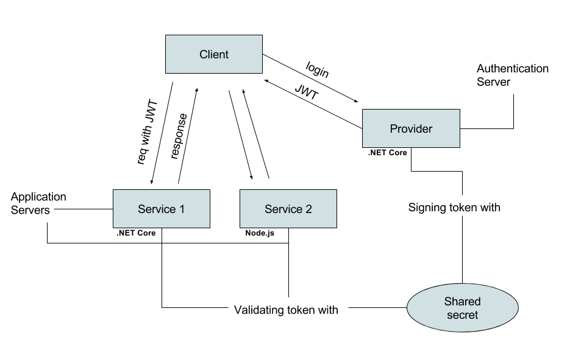

# jwt-core-demo

A demo of JWT (JSON web tokens) in .NET Core and Node.js running in docker (**Linux**) containers. It's one command to spin up the demo system (3 services) and one command to run a demo client. For more JWT goodness checkout the blog post linked below.

## prerequisites
* node.js 8.2.1 (if you haven't already, checkout [nvm](https://github.com/creationix/nvm) for multiple node versions)
* docker (tested on community edition 17.06.0-ce-mac19)

## install & run
1. clone this repo
2. run `docker-compose up`
3. in jwt/client run `npm install`
4. when compose is running the demo system run `node client/demo`

## the microservices scenario in this demo
One intent with this demo was to showcase how JWT ties in nicely with a microservices architecture. Below is an illustration of the simple scenario in this demo. 
  
 

Further reading on this topic: [JSON Web Tokens are made for Microservices](http://alexander.holbreich.org/jwt/)

## blog post

[JSON Web Tokens for people in a hurry](http://hellgrenj.tumblr.com/post/164328292793/json-web-tokens-for-people-in-a-hurry)

## next step
There are some community-led off the shelf solutions you should check out, for example:  
* [OpenIddict](https://github.com/openiddict/openiddict-core)  
* [IdentityServer](https://github.com/IdentityServer/IdentityServer4)  

I also want to recommend this blog post (which helped me alot): 
[ASP.NET Core Token Authentication Guide](https://stormpath.com/blog/token-authentication-asp-net-core)

## License

Released under the MIT license. Copyright (c) 2017 Johan Hellgren.

Permission is hereby granted, free of charge, to any person obtaining a copy of this software and associated documentation files (the "Software"), to deal in the Software without restriction, including without limitation the rights to use, copy, modify, merge, publish, distribute, sublicense, and/or sell copies of the Software, and to permit persons to whom the Software is furnished to do so, subject to the following conditions:

The above copyright notice and this permission notice shall be included in all copies or substantial portions of the Software.

THE SOFTWARE IS PROVIDED "AS IS", WITHOUT WARRANTY OF ANY KIND, EXPRESS OR IMPLIED, INCLUDING BUT NOT LIMITED TO THE WARRANTIES OF MERCHANTABILITY, FITNESS FOR A PARTICULAR PURPOSE AND NONINFRINGEMENT. IN NO EVENT SHALL THE AUTHORS OR COPYRIGHT HOLDERS BE LIABLE FOR ANY CLAIM, DAMAGES OR OTHER LIABILITY, WHETHER IN AN ACTION OF CONTRACT, TORT OR OTHERWISE, ARISING FROM, OUT OF OR IN CONNECTION WITH THE SOFTWARE OR THE USE OR OTHER DEALINGS IN THE SOFTWARE.